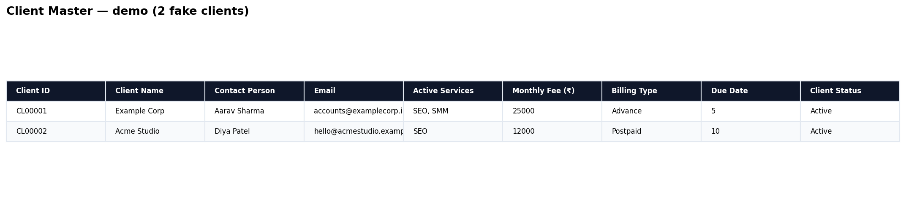
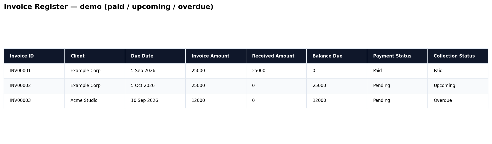
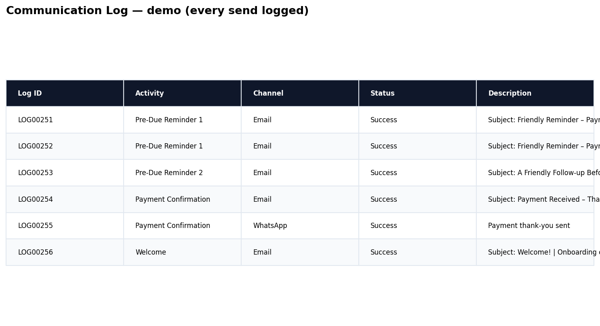

# Collections Operation — invoicing that follows up itself

**Consistent billing. Trackable payments. Less manual chasing. Full audit log.**

*Implementation detail for operators: typically built on Workspace + Apps Script at ₹0 running cost. The system matters, not the tool.*

Live in one agency today (retainers: SEO/SMM, Advance + Postpaid, due-date billing) with 260+ logged follow-ups.

## Problem it solves

- Founders/account managers chase retainers across scattered WhatsApp threads — which means good clients get awkward nudges and late payers slip through.
- No single view of who owes what, since when, and reminded how many times — so month-end means asking the team instead of opening one sheet.
- Paid tools add subscription cost yet still need follow-up discipline, WhatsApp-first tone, and per-invoice threading for this segment.

## Architecture

```
[ Client Master ] ──CL00001──▶ [ Invoice Register ] ──INV00001──▶ [ Payment Register ]
        │                              │                                   │
        │                              ▼                                   │
        │                     [ Reminder Engine (time trigger) ]            │
        │                       pre-due / overdue / recurring               │
        │                              │                                   │
        └──────────────▶ [ Communication Log (LOGxxxxx, every send) ] ◀────┘
                                       │ Email (Gmail) + WhatsApp (Cloud API)
                                       ▼
                              [ Drive: client folders + invoice PDFs ]
                              [ Settings: rules, templates, locale ]
```

- **IDs:** Client `CL00001`, Invoice `INV00001`, Payment `PAY00001`, Log `LOG00260` — auto-incremented via ID Generation Service
- **Money math:** `Received = SUMIF(Payment Register)`, `Balance = Invoice − Received`, `Status = Pending / Partially Paid / Paid`, `Collection = Paid / Overdue / Upcoming`
- **Validation colors:** red = duplicate ID / missing file / overpayment; yellow = due within 3 days / reminder due today; orange = invoice not marked sent
- **Threading:** `Email Thread ID` links follow-ups into one Gmail thread per invoice

## What ships

| Sheet tab | Purpose |
|-----------|---------|
| Client Master | One row per client: services, fee, billing type, due date, status, manager |
| Invoice Register (Dashboard) | One row per invoice: amount, link, received, balance, statuses, reminder counters |
| Payment Register | One row per payment: date, amount, method, ref no. |
| Communication Log | Every send: timestamp, activity, channel, success/failed + reason |
| Settings | Reminder cadence, business hours, penalties, signature, IDs, locale |
| Templates | 10 email + 10 WhatsApp bodies with `{{placeholders}}` |

Details:
- [`SHEET_SCHEMA.md`](./SHEET_SCHEMA.md) — columns + formulas
- [`REMINDER_RULES.md`](./REMINDER_RULES.md) — cadence + guardrails
- [`TEMPLATES.md`](./TEMPLATES.md) — message inventory
- [`SETUP_GUIDE.md`](./SETUP_GUIDE.md) — deploy in ~15 min

## Results (live system)





### Video walkthrough (3 min)

> _Pending — drop your Loom URL here. Script ready (hook → master → money flow → log → close)._

```md
[](PASTE_LOOM_URL)
```

- 260+ log rows: pre-due 1/2, overdue 1/2, welcome, invoice, payment confirmations
- Failure handling works: e.g. `Failed: No email address configured for client "X"` — visible, fixable, doesn't break the batch
- Multi-client batches run daily inside business hours (Asia/Kolkata, 10:00–19:00)
- Demo above uses fake data (`demo/*.csv`). Full column set in `SHEET_SCHEMA.md`.

> Operator note (live use, Sep 2026): 260+ logged sends across welcome, invoice, pre-due 1/2, overdue 1/2, and payment confirmations on Email + WhatsApp. Daily batches inside 10:00–19:00 IST; single-address failures logged with reason without breaking the batch. Client names redacted; full log shared under NDA.

> Demo data only in this repo. Live client names/amounts redacted. See [`demo/`](./demo/) for 2-client fake dataset you can screenshot.

## Cost & fit (implementation note, not the offer)

| Approach | Running cost |
|----------|------|
| This operation, as implemented | ₹0 — runs on tools the client already owns |
| Typical Zoho Books / QuickBooks + reminder add-on | Commonly ~₹10,000–₹30,000/yr + setup time (check current pricing — varies by plan) |

Fit, stated plainly: it needs one sender account within daily limits and one person keeping the master record clean. The validation colors + morning log check are designed so a junior can do that in minutes. Wrong fit for GST e-invoicing or 100+ invoices/mo — and I'll say so on the mapping call.

## Source model: private code, public proof

The live implementation is a multi-service setup (full inventory in `Code.gs.placeholder` — operator detail, not the headline). Full source stays private and is shared with prospects under NDA.

This repo proves capability without leaking code: architecture, sheet schema, reminder rules, template inventory, live log behavior (260+ sends), and setup guide. A 3-min Loom walkthrough beats a 3,000-line dump for buyers anyway.

If you're on desktop later and want to publish a sanitized excerpt: `clasp clone <SCRIPT_ID> && clasp pull`, replace secrets with `Script Properties`, commit as `Code.gs`.
